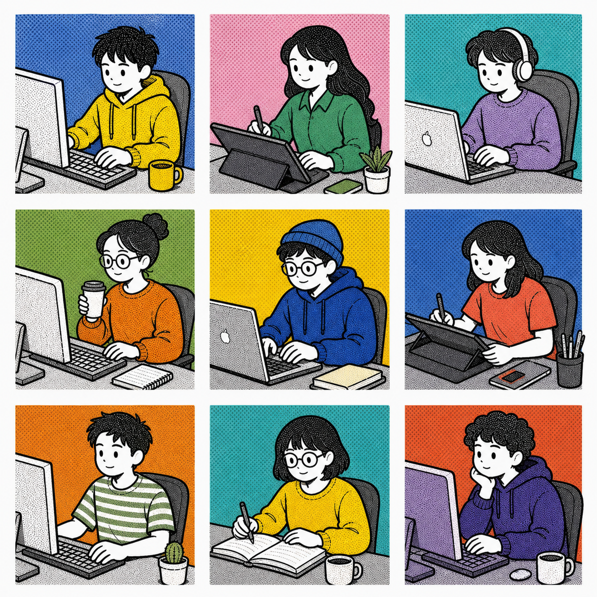

# 人格头像生成

本仓库收录两个并列的 Codex 人物头像生成 skills。

| Skill | 适用方向 |
| --- | --- |
| `american-comic-halftone-avatar/` | 美式漫画半调风格头像：青年角色、中等强度社论漫画表情、同批次不重复的低饱和旧报刊背景与选择性印刷细节。 |
| `screenprint-character-illustration/` | 丝网印刷人物插画：紧凑桌前构图、密集半调网点与可变角色系列。 |

每个目录均可独立安装。安装完成后，重新开启 Codex 会话即可调用。

## 下载仓库

```bash
git clone https://github.com/changxuan0423/personality-avatar-generation.git
cd personality-avatar-generation
```

## 安装方法

### 1. 美式漫画半调风格头像

运行该 skill 自带的安装脚本：

```bash
./american-comic-halftone-avatar/install.sh
```

也可以手动安装：

```bash
mkdir -p ~/.codex/skills
cp -R american-comic-halftone-avatar ~/.codex/skills/
```

### 2. 丝网印刷人物插画

```bash
mkdir -p ~/.codex/skills
cp -R screenprint-character-illustration ~/.codex/skills/
```

## 调用示例

### 美式漫画半调风格头像

```text
使用美式漫画半调风格头像 skill，生成角色：营养顾问
```


### 丝网印刷人物插画

```text
使用 screenprint-character-illustration skill，生成一个新的桌前单人物丝网印刷插画
```



仓库根目录的 `american-comic-halftone-avatar.tar.gz` 是第一个 skill 的便携安装包。
